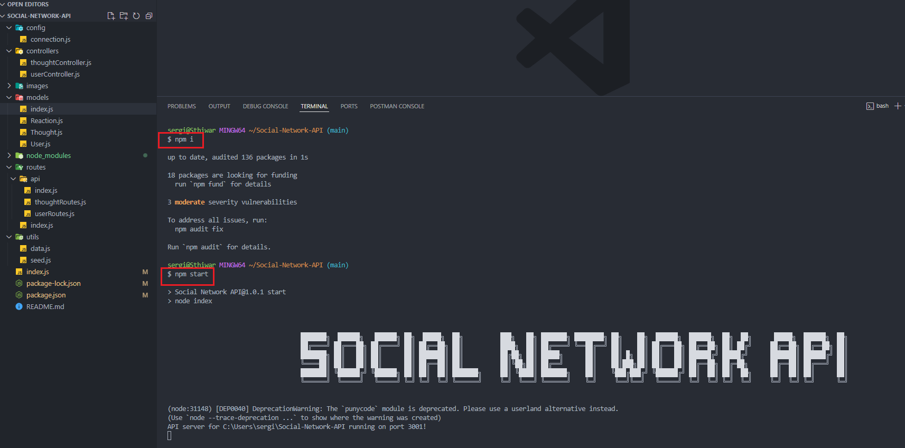
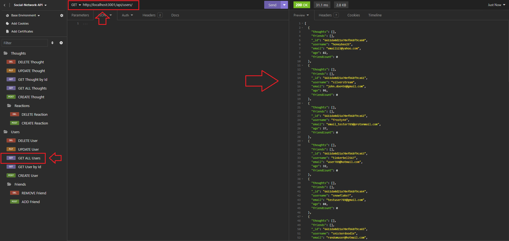
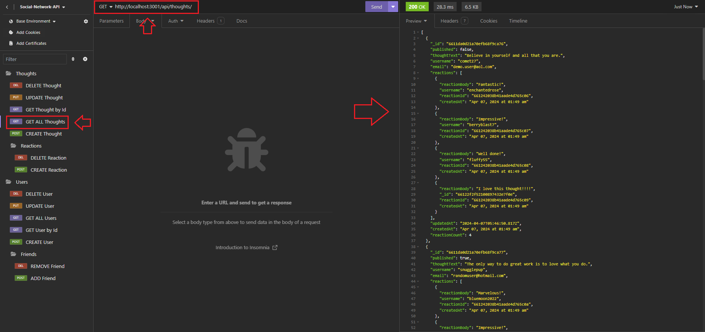

# Social-Network-API

## Description  :bookmark_tabs:
My Social Network API is a project that I designed because I wanted to see how a network API worked using MongoDB. Motivated by a vision of creating a platform where users can freely share thoughts, connect with friends, and express reactions. Through this endeavor, I immersed myself in API design, mastering CRUD operations for users and thoughts while also implementing features for managing reactions and friendships. This project has been a great learning experience, teaching me the intricacies of data modeling, system architecture, and user-centric design of MongoDB. It has reinforced the importance of databases in real-world applications for me.

## Installation :computer:

You are able to check this app by two ways:

 1. If you want to check a video of the functionality of the app, you can go to this URL: 
 2. If you want to try it yourself, you have to have "Node.js" installed in your computer, then you have to clone my repository and run it locally.

## Usage :bar_chart:

If you want to try the app yourself make sure you have "Node.js" in your computer, and do not forget to run the next lines of code to start the app:
    
    npm i

After that run one of the next line:

    npm start

 
 ---
You will be prompted with a title of the app, so now you can test it in Insomnia, we can GET all users:  

 
 ---
We can GET all thoughts:

 
 ---
And we can do lots of things, such adding more thoughts, updating and deleting them. Adding reactions, also adding friends to the User and whatnot.
## Credits :email:

List of all the links that made me succeed this project:
- https://www.mongodb.com/docs/manual/core/index-unique/
- https://mongoosejs.com/docs/queries.html
- Exercises from the class and mini-project

## License :memo:
---
---
MIT License

Copyright (c) 2023 Sergio S. Ardila-Alvarado

Permission is hereby granted, free of charge, to any person obtaining a copy
of this software and associated documentation files (the "Software"), to deal
in the Software without restriction, including without limitation the rights
to use, copy, modify, merge, publish, distribute, sublicense, and/or sell
copies of the Software, and to permit persons to whom the Software is
furnished to do so, subject to the following conditions:

The above copyright notice and this permission notice shall be included in all
copies or substantial portions of the Software.

THE SOFTWARE IS PROVIDED "AS IS", WITHOUT WARRANTY OF ANY KIND, EXPRESS OR
IMPLIED, INCLUDING BUT NOT LIMITED TO THE WARRANTIES OF MERCHANTABILITY,
FITNESS FOR A PARTICULAR PURPOSE AND NONINFRINGEMENT. IN NO EVENT SHALL THE
AUTHORS OR COPYRIGHT HOLDERS BE LIABLE FOR ANY CLAIM, DAMAGES OR OTHER
LIABILITY, WHETHER IN AN ACTION OF CONTRACT, TORT OR OTHERWISE, ARISING FROM,
OUT OF OR IN CONNECTION WITH THE SOFTWARE OR THE USE OR OTHER DEALINGS IN THE
SOFTWARE.

---
---
